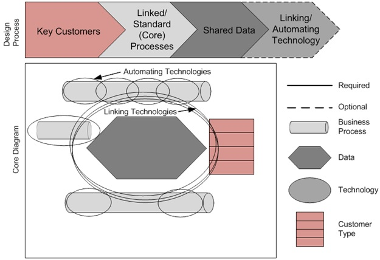
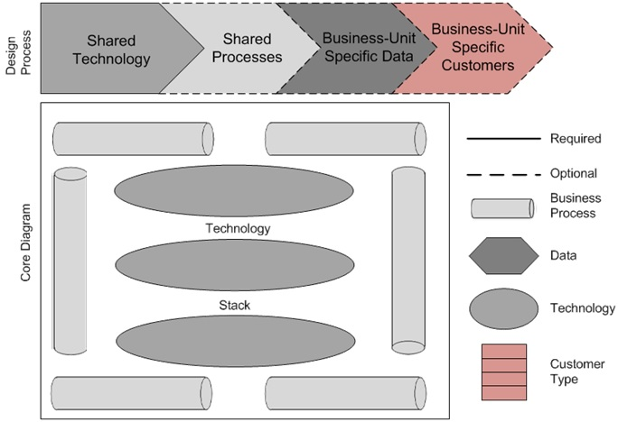
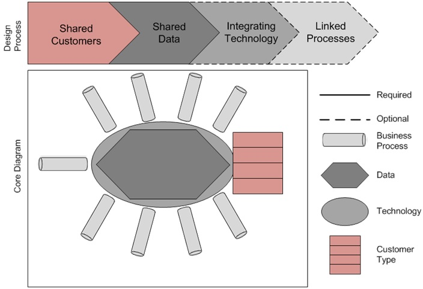
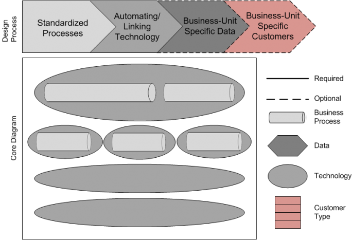

# Enterprise Architecture

Antwerp, 2021, Carlos Tubbax.

Once a company has defined one or several operating models depending on its business process integration and
standardization requirements, it can then draw its enterprise architecture that reflects the company’s key processes,
systems, and data embedded at the company's core.
More formally, an Enterprise Architecture is defined by Ross, Weil, and Robertson (p. 47, 2006) as

> the organizing logic for business processes and IT infrastructure reflecting the integration and standardization
> requirements of the company's operating model.

It is essential to effective enterprise architecture to identify the processes, data, technologies, and
customer interfaces that take the operating model from vision to reality as explained
by Ross, Weil and Robertson (2006).
These key elements are different for each of the four operating models.

## Core Diagrams

A core diagram is a one-page picture of the high-level view of the processes, data, and technologies needed as a
foundation for execution.
The purpose of this core diagram is to facilitate discussions between IT and business managers to help clarify
requirements for the company's foundation for execution and communicating the vision.

Although each core diagram can be unique to each organization, four common elements can be found almost
in any core diagram, which are listed as follows:

- **Core business processes:** This small set of processes constitute the stable set of company-wide
  capabilities that the company needs to execute its operating model and respond to market opportunities.
- **Shared data driving core processes:** This is data shared across different end-to-end 
  business processes by all the parties participating in these processes, such as business units or even suppliers.
- **Key linking and automation technologies:** There are different technologies that fall within
  this category.
  First, _middleware technologies_ that enable integration of applications and access to shared data
  such as ERP packages, data-warehouses, and knowledge graphs, are the first kind of these technologies.
  Moreover, portals providing standardized access to systems and data are the second type of
  these technologies.
  Finally, electronic interfaces facing stakeholders, such as suppliers, employees and partners
  could also appear on the company’s core diagram.
- **Key customers:** These show the company's primary customer groups (e.g., channels or segments).

The four different types of core diagrams are discussed in the following subsections.

## Unification Model

The core diagram for a Unification Model is shown in figure 1.
Integration and standardization of business processes is necessary to serve key customer types in a Unification model.
The top of figure 1 identifies the necessary and optional elements for business process designing, which are:

1. identifying key customers,
2. identifying and showing the key processes to be integrated and standardized,
3. identifying and showing the key data imperative to better integrate 
   and standardize processes and serve customers, and
4. identifying and showing the key technologies that either automate 
   or link processes (this optional as depicted by the dashed outline).

This core diagram provides a high-level overview of a company's enterprise architecture with highly standardized and
integrated processes implementing a Unification operating model.

<figure markdown>
  { width="700" }
  <figcaption>Figure 1: Core Diagram Design Process4 ©2005 MIT Sloan Center for Information Systems Research and IMD</figcaption>
</figure>

## Diversification Model

Since the diversification model entails the least amount of business process standardization and integration,
it is the opposite of the unification model.
In a unification model, each business unit functions more or less independently even though there can be opportunities
for shared services across the company.

<figure markdown>
  { width="700" }
  <figcaption>Figure 2: Diversification Operating Model Core Diagram4  ©2005 MIT Sloan Center for Information Systems Research and IMD</figcaption>
</figure>

An extreme example of a Diversification model would be a total lack of an enterprise architecture in which there is
no collaboration nor communication between business units.
However, these business units could benefit from economies of scale by adopting a shared technology platform and
are the key elements of the core diagram in figure 2.
Such shared technologies and services could take the form of data centers, telecommunications networks,
help desks, offshore systems development and maintenance capability, centralized vendor negotiations, etc.
If different business units may benefit from shared services and technologies, they could depict that in the
core diagram of the company.

Additionally, if business units may also benefit from certain shared data, they could also add that to the company's
core diagram.

Since shared platforms are the most important component of a core diagram of a company implementing a
diversification model, start with the technologies that---when shared---could provide economies of scale,
standardization, or other benefits.

The other remaining key elements---key customer types, shared processes, and data---should only be incorporated
to the extent that they are common between business units and necessary for the operating model.
For example, some data should be modelled in the core diagram as it may be shared at corporate level for
financial reporting, risk management, and compliance across different business units.

## Coordination Model

A company implementing a coordination model uses a high amount of business process integration to offer a service
or product to each customer group.
This high amount of integration results from sharing key data across business units to present a common face to
the customer.
Coordination allows companies to integrate many processes or products to the customer in a black-box fashion without
forcing high levels of standardization.

The enterprise architecture core diagram for the Coordination operating model depicts the emphasis on integration
and thus on shared data within a company.
Commonly, the core diagram will also show important technologies used by stakeholders to access this shared data.
Processes could also be shown in the core diagram if they need to be coordinated across business units.
However, processes are often not depicted in the core diagram of a coordination model as they are mostly unique
and can differ to a great extent across business units.

<figure markdown>
  { width="700" }
  <figcaption>Figure 3: Coordination Operating Model Core Diagram4 ©2005 MIT Sloan Center for Information Systems Research and IMD</figcaption>
</figure>

## Replication Model

A Replication operating model is recommended when key processes need to be highly standardized but not integrated
across the company by means of an automating technology.

Standardized processes is the key concept in Replication operating models.
So, key standard processes and, often, the key technologies enabling those processes are the first things shown
in the enterprise architecture of a company implementing a Replication operating model.
In contrast to that, data rarely appears in the core diagram because business units in a Replication company
barely share data.
In order to drive up productivity, these companies could also automate key standardized business processes resulting
in reusable business modules.

When drawing a Replication model core diagram (figure 4),
start with the key processes to be standardized and replicated across the business units.
Then, identify the technologies automating those key processes.
Next, look at the technologies automating those key processes that could eventually be shared across the business units.
However, since business units barely share data or have the same customer types as those decisions are made locally,
it is not necessary to add them to the core diagram.

<figure markdown>
  { width="700" }
  <figcaption>Figure 4: Replication Operating Model Core Diagram4 ©2005 MIT Sloan Center for Information Systems Research and IMD</figcaption>
</figure>

## The core diagram as a high-level overview of an Enterprise Architecture

The enterprise architecture core diagrams offered in the section are useful to have a high-level overview of the
business process and IT requirements of a company’s operating model.
However, they do not offer the necessary detail to map out technical or process design requirements.
A high-level enterprise architecture only offers a shared understanding of how a company will operate,
but the synergies between people, process and technology necessary to implement that architecture demands
shared understanding at a more detailed level.
