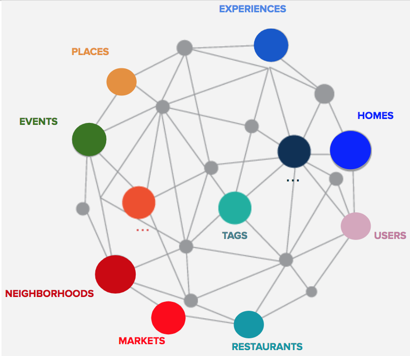
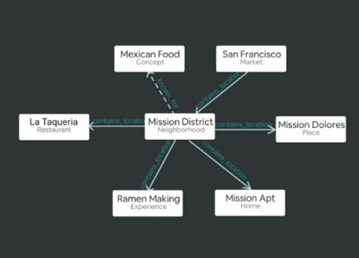
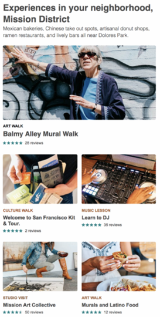

Antwerp, December 2021, [Carlos Tubbax](../other/author/carlos-tubbax.md).

# The value proposition of EKG

Companies face increasingly difficult challenges due to the complexity of their
business environments stemming from market disruptions, new regulations, 
the COVID-19 pandemic or other large scale events. 
In such a challenging business world, being able to have a clear oversight 
of an organization as a whole has become more critical than ever to 
assess risk exposure, to find supply chain bottlenecks, 
to comply to regulations among other business requirements. 
Therefore, *connecting the dots* spread inside and outside each company 
is necessary for all these crucial tasks. 
In this context, the word *dots* refers to data needed to carry out these 
different tasks.

However, _connecting the dots_ is far easier said than done as these dots 
are most often spread across a myriad of business silos that may not even 
aware of each other’s existence and in different formats that make the 
task of integrating and harmonizing data across the enterprise overly complex.

As a solution to this problem, the Semantic Web and its underlying standards
were developed as an answer to integrate, identify, catalogue, harmonize 
and assign meaning to individual pieces of data from different sources. 
Enterprise Knowledge Graphs (EKGs) aim at doing that at an enterprise-wide 
level by using Semantic Web standards and technologies. 
Additionally, EKGs can boost other technologies such as machine learning 
and blockchain by feeding them with high-quality and meaningful data.

The purpose of this maturity model is to guide companies and other 
organizations throughout the development of Enterprise Knowledge Graphs 
as a tool to develop capabilities that they may consider vital for their 
own businesses such as risk management or customer 360° and for 
which connecting the dots is necessary. 
Since this journey will certainly require lots of time and effort, 
this maturity model aims at providing a step-by-step rationale of 
how companies can develop EKGs that serve their own business needs. 
The maturity model will guide enterprises throughout its different
maturity levels that will mark the progress of the Enterprise in
developing EKG(s) for this kind of enterprise-wide use cases.
In order to make the utility of Knowledge Graphs for enterprises
clearer, this part will provide some examples of how knowledge graphs 
could be used to tackle the aforementioned problems and to 
connect the dots for some use cases. 
However, the decision of which use cases need to be supported and 
prioritized is up to each enterprise. 
Therefore, the following examples are just mere illustrations of 
what companies can do by connecting the dots.

People using Amazon’s Alexa, ordering food through Uber Eats or 
booking a listing on Airbnb are using a knowledge graph even if 
they are totally unaware of that. 
Amazon, Alexa, Uber among other cutting-edge companies have been 
using knowledge graph technology to disrupt entire sectors and 
to create new value propositions to their customers.[^1]
For example, Amazon uses a _product graph_ to categorize products
on its retail website and to make better product suggestions to 
customers among other things.[^2]
In that context, Knowledge Graphs fulfills the role of 
disruption enabler. 
In order to illustrate this, it will be discussed how Airbnb uses 
a knowledge graph to enhance its customer experience by integrating
and conducting computer reasoning on data coming from
different data sources.  

[^1]: [Food Discovery with Uber Eats: Building a Query Understanding Engine](https://eng.uber.com/uber-eats-query-understanding/)
[^2]: [All You Need to Know to Build a Product Knowledge Graph](https://naixlee.github.io/Product_Knowledge_Graph_Tutorial_KDD2021/)

On the other hand, Enterprise Knowledge Graphs may also provide
great value when being used to support the daily operations of 
a business and, in that context, the enterprise is their end user. 
Although there are fewer examples of knowledge graphs being used 
in this context, Deloitte’s white papers discusses how 
knowledge graphs could be used in organizations to unravel 
the intricacies of their own business processes, relationships,
supply chains, etc. by the means provided by Enterprise Knowledge Graphs
as a business supporting/enabling technology.
      
## Customer experience enhancement at Airbnb

In order to move towards its vision of becoming an end-to-end 
travel platform, Airbnb needs to be able to provide customers 
insights that help them decide when to travel, where to travel 
and what to do in their trips. For instance, Airbnb needs to 
be able to answer queries such as:

- *What are the most popular landmarks and neighborhoods in London?*
- *Which Airbnb listings are best suited for working nomads?*
- *What are the most popular Italian restaurants in New York?*

{ align=right width="400"}

Answering these queries may help travelers plan their trips
much better and, in turn, Airbnb may increase its 
customer value proposition. 

As a means to answer all these customer queries, 
Airbnb uses a knowledge graph represented by the figure on the right.

As explained by Chang (2018)[^3], semantic web knowledge graphs 
offer the ability of structuring and adding meaning to data 
from different sources such as relational databases in a scalable 
way to answer these queries. 
Additionally, it is far simpler to connect data about a 
certain object spread across different data sources with a 
knowledge graph than it is with a relational database. 
Another advantage of knowledge graphs compared to 
relational databases is that new relationships between concepts 
or objects can be added to a knowledge graph in a much more 
flexible and simpler fashion.
{ align=right width="400"}
{ align=right width="400"}
For instance, knowledge graphs can link the concept _surfing_ as 
a sport to the concept surfing which Hawaii is known for. 
So, if a customer asks Airbnb’s website for _surfing destinations_, 
Hawaii may appear on the query results.
This kind of associations might be far more difficult in a 
relational environment especially if the data about them 
come from different sources with different schemas.

[^3]: [Spencer Chang: Scaling Knowledge Access and Retrieval at Airbnb](https://medium.com/airbnb-engineering/scaling-knowledge-access-and-retrieval-at-airbnb-665b6ba21e95)

By connecting data about places, experiences, homes, restaurants, 
etc. as illustrated here, Airbnb is able to answer
complicated user queries[^4] such as What events, restaurants and 
homes are located in Mission District in San Francisco? as shown 
on the right and below.

In this way, Airbnb is moving forward into becoming an end-to-end 
travel platform that serves its customers throughout their entire 
journeys instead of only renting listings out.

[^4]: [Xiaoya Wei: Contextualizing Airbnb by Building Knowledge Graph](https://medium.com/airbnb-engineering/contextualizing-airbnb-by-building-knowledge-graph-b7077e268d5a)
