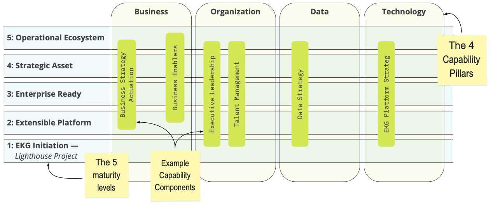

---
hide:
- title
- toc
---
The EKG Maturity Model is a "continuous improvement" product of the EKGF.

It is intended to be updated based upon the comments of readers and implementers.
Comments are reviewed by EKGF members and may result in new or changed content.
You can contribute via [GitHub](https://github.com/EKGF/ekg-maturity).

See [structure](structure/index.md) for more information.
