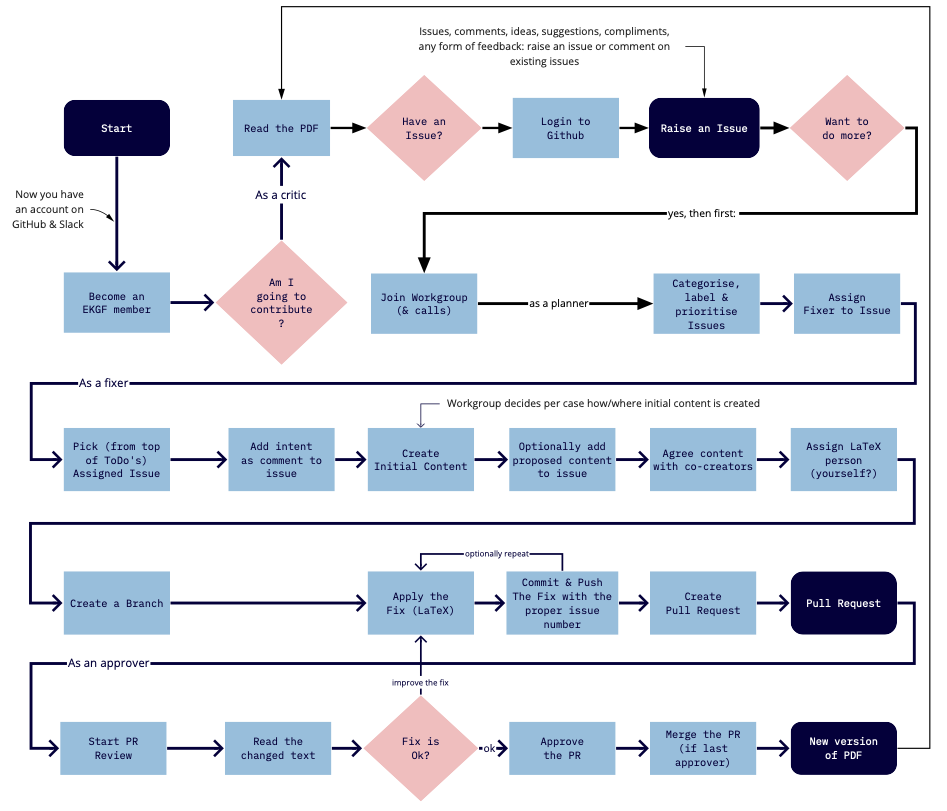
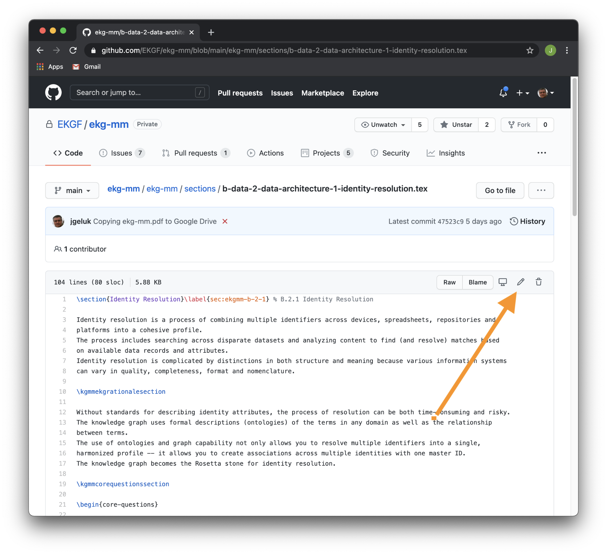
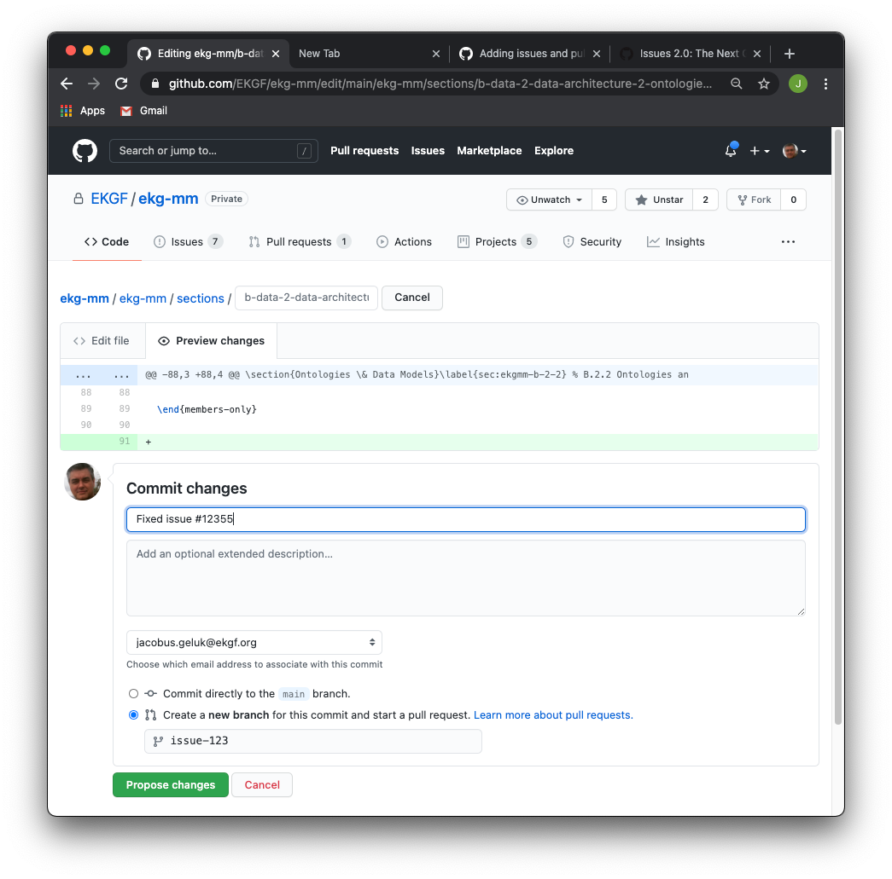
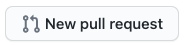

# How to contribute

!!! note warning

     some of the content on this page still assumes that we're generating one PDF file
     as the deliverable. We're in the process of switching over to just generating this
     website instead which requires some minor changes in the process described here.

## Introduction

The [EKGF](https://ekgf.org) is a non-profit member-driven organization that unites parties
in the EKG space to define best practice and matures the marketplace for
EKG adoption, including:

- semantic standards to solve the challenges of data management 
- a method for accelerated EKG deployment

One of the activities of the EKGF is its work on the EKG maturity model ([EKG/Maturity](https://maturity.ekgf.org))
which establishes standard criteria for measuring and guiding progress
on EKG adoption through asking practical questions of different
involved stakeholders. 

In order to be able to scale to a larger community of collaborating teams, 
each contributing content to the EKG/Maturity, we decided to "eat our own dogfood" 
and apply the same principles as we advocate for software development and
data management such as "work Agile" and "test everything".

## The Process

The collaboration process consists primarily of the following "user stories":

- As a <ins>critic</ins>, I want to be able to **raise an issue**
- As a <ins>workgroup member</ins>, I want to be able to **plan issues**
- As a <ins>fixer</ins>, I want to be able to **fix issues**
- As a <ins>reviewer</ins>, I want to be able to **approve pull requests**

To summarize, we have 4 main things to do:

1. [Raise](#raise)
2. [Plan](#plan)
3. [Fix](#fix)
4. [Approve](#approve)

An issue can be anything, your feedback, ideas, suggestions, spelling mistakes,
inconsistencies, anything that should be changed on this website.

## Raise

!!! note "**User Story**"

    - As a <ins>critic</ins>, I want to be able to **raise an issue**

Anyone who reads the produced content and has an issue with that content is a "critic".
Each critic should be able to raise that issue formally with minimal effort.

The audience of critics is hopefully very large, any reader of our content should
be able to add their comments somewhere.
We have to make it as easy as possible for them to do so. 

Unfortunately, the Issue Management function of GitHub repositories ---
like the [EKGF/ekg-maturity](https://github.com/ekgf/ekg-maturity) repository --- can only be
used by people who have a GitHub account.

As someone in the role of a critic, you don’t have to deal with "Agile"
or "Kanban". 
The various workgroups/teams will plan for (see [Plan](#plan))
and process/fix (see [Fix](#fix)) your issues. 
You can always see the status of your issue by clicking on it and checking 
the right side of the screen where you see links to the "Assignee"
(the person who is going to work on your issue), the "Project"
(the workgroup that’s planning and tracking your issue) and the "Linked pull requests". 

### How to register?

We are asking every potential contributor, even someone who just wants to give us
some feedback (a "critic") to join the EKGF as a private member (free) or as a
corporate member.

Email with [registration@ekgf.org](mailto:registration@ekgf.org) to set it up,
if you plan to participate as a contributor to the EKG maturity model then please also
supply your GitHub user-id.

#### How to create a GitHub & Slack account?

##### Slack

If you already have a Slack account then join the EKGF workspace 
here: [https://ekgf.slack.com/](https://ekgf.slack.com/).
Otherwise, first create your Slack account [here](https://slack.com/get-started\#/create).

##### GitHub

Go to [https://github.com/join](https://github.com/join).

Since you can associate multiple email addresses to your GitHub account we would
suggest to initially create it with your private email address which then becomes
your "primary email account" in GitHub.
You can add your business email address(es) to your GitHub account later.

Mail your GitHub account id (user-id) to
[registration@ekgf.org](mailto:registration@ekgf.org) so that we can add you
to the access control list of the [EKGF/ekg-maturity repository](https://github.com/EKGF/ekg-maturity).

### How to raise an issue?

While you’re reading the website, you may have comments, we hope you do.
Please raise as many "issues" as possible, any feedback is welcome.
An issue can be a question, a suggestion, a grammar issue, 
an issue with the consistency of the story, anything that comes to mind. 
If you decide to let us benefit from your feedback then please follow these steps:

- Go to the main page where all issues are shown:
  [https://github.com/ekgf/ekg-maturity/issues](https://github.com/ekgf/ekg-maturity/issues) 
- Check if your issue is already raised by someone else, if so, 
  feel free to augment the discussion around that issue with your own concerns.
- If it clearly is a new issue,
  click the ["New Issue" button](https://github.com/EKGF/ekg-maturity/issues/new).
- Give it a concise title and clear description and ideally:
    - Copy paragraphs you don’t agree with into the issue
    - Copy the URL of the relevant page into the issue 
- There is no need to specify values for any of the fields on
  the right side because the admin team will do that (but feel free to).
- Save by clicking the “Submit new issue” button

That’s it. Thank you very much. Every issue is a discussion page,
other people can respond to it and chip in. 
At some point, a workgroup will pick it up, assign it to their project board, 
plan for fixing it, etc. You will be notified of these changes 
automatically via GitHub email.

## Plan

!!! note "**User Story**"

     - As a <ins>planner</ins>, I want to be able to **plan issues**

Work on the EKG maturity model is divided among workgroups that each take on one of 
[the four maturity model pillars]
or horizontal slice of the maturity model. 
Workgroups are self-managed teams. 
The workgroups meet on a regular schedule. 
Any method that the team agrees to use to plan and to document issues during 
working sessions is ok. 
But, the official content of the maturity model is contained in the GitHub repository 
that is managed using the GitHub Kanban with review and automation process.

Here are some useful links. 

- [Kanban - A brief introduction](https://www.atlassian.com/agile/kanban)
- [What is a Kanban Board?](https://www.atlassian.com/agile/kanban/boards)

The idea is very simple though, we use the GitHub Projects facility. 
Currently, we have a project for each pillar and a general project. 
Here’s the main page for EKG/Maturity GitHub Projects: 
[https://github.com/EKGF/ekg-maturity/projects](https://github.com/EKGF/ekg-maturity/projects)

What you see is a list of "project boards" where each project board 
is owned by a workgroup in the entire Kanban process. 
This begins with planning. 

The planning process consists of various tasks:

- Find open issues that are relevant to the workgroup in the list of issues:
    - [open issues that have not yet been assigned to a project board](https://github.com/EKGF/ekg-maturity/issues?q=is%3Aissue+is%3Aopen+no%3Aproject)
- Link each issue that should be done by the workgroup to its
      corresponding project board.
      It will then appear at the bottom of the “To Do” column of that board.
- Decide priority (see [To Do Column](#to-do-column)).
- Assign issues to members of the workgroup.
    - By linking the issue to one or more assignees (open the issue by 
      clicking on it and select the assignee at the top right corner)
- Follow the progress of issues as they go from left to right via the columns on the board.

### "To Do" Column

As soon as an issue has been assigned to a given project, 
it will show up at the bottom of the To-Do Column.
That To-Do Column can be seen as "the backlog"
for that project (and for the workgroup that owns that project).

Issues can be dragged and dropped within the To-Do Column. 
Issues at the top have the highest priority. 
Anyone in the workgroup can pick up issues assigned to 
them and start "fixing" them (which means resolving them), 
see [Fix](#fix).

### "In progress" Column

_Pull Requests_ (PRs) and _Issues_[^issues-are-cards] 
show up in this column automatically as soon as someone is 
actually working on the issue, see [Fix](#fix).

This means that as soon as a fixer "pushes" one or more "commits" 
to the GitHub repository that this will be seen as progress 
and show up accordingly on the project board.

### "Review in progress" Column

Once the fixer has created their PR, they can ask 
for a review of the PR by selecting two or more reviewers. 
See [Approve](#approve) for information about how to do a review.

### "Reviewer approved" Column

Once all reviewers have approved the PR, 
the last reviewer can then merge the PR into the main branch. 
By the way, a reviewer can also reject a change or ask for 
changes to be applied before approving the PR. 

The fixer then has to then apply new changes and commit 
them to the same branch and push those changes to GitHub. 
The PR page will then be updated automatically and a subsequent 
review process can then commence.
As said above, once all approvals are given, 
the changes can then be merged by the final reviewer 
into the main branch which will trigger the final build 
workflow on GitHub creating a new version of the website you're looking at.

### "Done" Column

When the merge of the PR is done the issue will move to 
the Done column. 

For each PR there is an underlying git branch which 
will be automatically deleted by GitHub once the PR 
has been merged into the main branch.

## Fix

!!! note "**User Stories**"

    - As a <ins>fixer</ins>, I want to be able to **fix issues**
    - As a <ins>fixer</ins>, I want to be able to **create a pull request**

The term "fixer" is our own term, they’re usually called "developer" but
we don’t consider someone who works on EKG/Maturity content to be a developer necessarily.
In the GitHub user interface, they show up as "contributors".
Anyone who actually changes things in the repository will be registered by GitHub as 
a contributor to that repository[^github-userids].

There are several ways to change the content of the repository. 
There are roughly two methods though:

1. Change content without making a _clone_ of the repository by 
   editing content on the GitHub site itself.
2. Make a so-called _git clone_ of the repository to your own
   workstation and use any appropriate editor to add or change things.

Both methods require:

- "creating a branch" (See [How to make a branch?](#how-to-make-a-branch))
- "committing a change" (See [How to commit a change?](#how-to-commit-a-change))
- "creating a pull request" (See [How to create a Pull Request?](#how-to-create-a-pull-request))

We will now describe how each of these three tasks can be done.

### How to start editing in GitHub?

This is "Method A" as described above.
First find the content file that you want to edit.
All content is under the content root directory 
[`/docs`](https://github.com/EKGF/ekg-maturity/tree/main/docs).

The arrow in the figure above shows the
location of the "edit button" (ignore the other buttons). 
Click that button and change any content. 
All content is written in a "language" called Markdown which is
a markup language for text content. 
Here's a [Markdown "cheat sheet"](https://www.markdownguide.org/cheat-sheet/) 
as one page that shows everything you need to know about Markdown.

Then it’s time to save the changes, choose a good title for your 
change, and include the issue number (for instance `#123`)
prefixed with a hash.
This title is the so-called "commit message" and is described in 
more detail in [How to commit a change?](#how-to-commit-a-change).

### How to make a branch?

When editing straight on the GitHub site as described in the previous 
section, you have to save your work "as a commit" with a title that 
contains the issue number (which will be picked up by the project board). 
But you then also have to create a branch which shows up right under 
the title and description. 

Choose a branch name that explains what it is about. 
In some cases that would be all there is to it but in most cases you 
have multiple edits in multiple files for one given issue. 
So in those cases you would have to make sure to always refer to 
the right branch name where the branch name must include the 
issue number itself. 
For instance, for issue `#123` the branch name would 
be `issue-123`.

### How to commit a change?

There are several ways to create a commit on a branch in a 
git repository. It’s up to the "fixer" (usually called "developer"
in most git documentation on the Internet) to decide which
tooling they use.
One way to do this is to just use the Github website itself but you
could also create a so-called "clone" of the git repository on your 
local machine and use the standard git utility to create a commit or 
use an advanced editor like [Visual Studio Code](https://code.visualstudio.com/download)
that has built-in git and Markdown support.
It goes too far to document all the various different ways to do this 
in the context of this document.
What’s important to know is that, as a fixer, you should always include
the issue number in the title of the commit. 
For example, if you edit a content page and then commit that change, 
you have to make sure that these two things are done before clicking 
the "Propose Changes" button as shown in the figure above.

Use a title for your commit that includes the issue number, 
prefixed by `#`, for example, `#123` for issue 123.
Use a branch name that includes the issue number (no hash as a prefix).

The `#123` in the title will trigger GitHub to move the
corresponding issue from the "To Do" column to the "In Progress" column.
Do not use `Fixed #123` or `Close #123` because that 
will actually close the issue.

Once you have done your first commit to a given branch, you’re ready to
create a PR. 
Many people wait with creating a PR until their last commit is pushed
(one issue can involve many commits involving many files, but they all 
go to the same branch) but we recommend creating your PR as soon as possible, 
after the first commit, because that gives everyone an easier insight 
in the progress. Not everyone is up for that, “exposing” their 
first draft changes to others, but it’s generally seen as 
good practice doing so. 
You can mark your PR as “Draft” via the GitHub user interface so that 
everyone knows that it is “work in progress”.

### How to create a pull request?

Assuming that you added some changes to a branch, in GitHub parlance: 
"pushed some commits to a branch", you can also create a PR. 
A PR can be seen as a "request approval to change"-form. 
It needs two branches: the branch that you want to change (that would 
usually be the main branch) and the branch that contains the new version 
with the proposed changes. 
GitHub automatically calculates the difference between those two branches
and shows those differences on the PR-form.

There are several places in the GitHub user interface where you 
can start creating a PR but the most basic one shows up at the
[branches page](https://github.com/EKGF/ekg-maturity/branches) which
shows all branches of the repository:

- [https://github.com/EKGF/ekg-maturity/branches](https://github.com/EKGF/ekg-maturity/branches)

On the right side of the table showing all the branches you either see an 
existing PR for the given branch or a button:

It’s easy from there. 
Give your PR a good title (that title goes into the "changelog" so be 
specific, although not to worry, it can be changed later) 
and a description and click the Create Pull Request button. 
Job done. A planner in the workgroup will take it from there, 
assign reviewers, link it to a project board etc.

## Approve

!!! note "**User Story**"

    - As a <ins>reviewer</ins>, I want to be able to **approve pull requests**

TODO

[^issues-are-cards]: Issues are sometimes also called “Cards” in 
  Kanban terminology and in the Github project user interface.
  Besides that you can also add “Notes” to the project board.
[^github-userids]: The GitHub userids and names of all contributors 
  will be listed [here](contributors.md).
